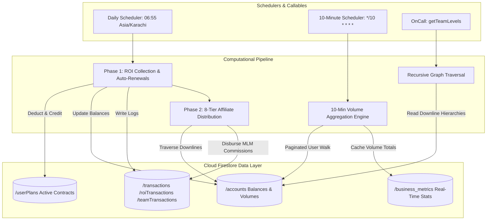
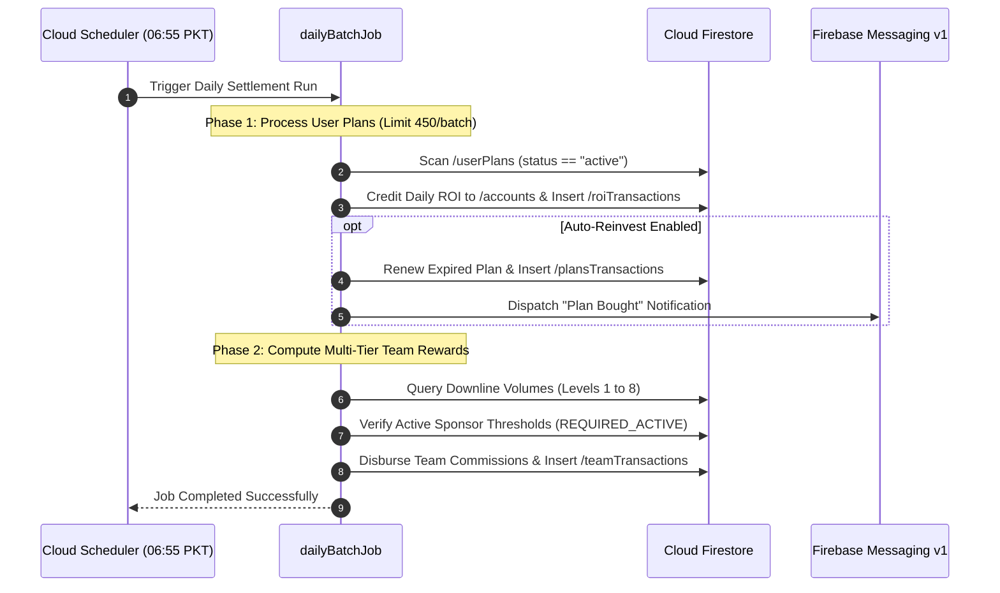

# BitBloom (Cloud Functions Financial Suite)

[](https://firebase.google.com/docs/functions)
[](https://nodejs.org)
[](https://firebase.google.com/docs/firestore)
[](https://cloud.google.com/functions)
[](LICENSE)

> Serverless financial orchestration backend for BitBloom, automating daily ROI dividends, 8-tier affiliate network tree calculations, 10-minute high-frequency business volume aggregations, and on-demand network graph inspections.

---

## 📖 Overview

**BitBloom Cloud Functions** represents the computational core of the BitBloom fintech ecosystem. Operating on **Firebase Cloud Functions v2 (Cloud Run serverless infrastructure)** and the **Firebase Admin SDK**, this suite delivers deterministic, highly concurrent financial settlement jobs, multi-level commission payouts, and real-time affiliate tree graph analytics.

### Key Capabilities
- **Daily ROI & Renewal Settlement**: Automatically calculates daily yields, executes auto-reinvestments, and writes categorized transaction ledgers (`roiTransactions`, `plansTransactions`).
- **8-Level MLM Commission Traversal**: Traverses referral downlines, validates active member unlocking thresholds (`[0, 2, 4, 6, 8, 10, 12, 14]`), and credits direct/indirect affiliate earnings.
- **High-Frequency 10-Minute Volume Aggregator**: Scans the network every 10 minutes to pre-aggregate direct and indirect team deposit volumes into `/business_metrics/{uid}` for instant leaderboard queries.
- **Dual-Mode Graph Inspector**: Serves on-demand HTTPS callable functions delivering full 6-to-8 tier tree summaries or granular per-level member directories.

---

## 🏗️ Architecture & Execution Pipeline



### Nightly Financial Settlement Sequence



---

## ✨ Serverless Modules & Schedulers

### 1. 🌅 `dailyBatch.js` — Nightly Financial Settlement
- **Trigger**: Cloud Scheduler cron (`55 6 * * *` — Daily at 06:55 PKT).
- **Resources**: `4GiB` RAM, 540-second execution window.
- **Phase 1 (ROI & Renewal)**: Reads paginated user plans (`PLAN_PAGE_SIZE = 5000`), calculates daily yields, executes auto-reinvestments, and batches transaction writes (`PLAN_WRITE_LIMIT = 450`).
- **Phase 2 (Team Level Rewards)**: Evaluates downline networks across 8 levels, enforcing active member unlocking rules (`[0, 2, 4, 6, 8, 10, 12, 14]`), updating `teamTransactions` and `earnings.teamProfit`.

### 2. ⚡ `aggregatebusinessevery10min.js` — High-Frequency Volume Aggregator
- **Trigger**: Cloud Scheduler cron (`*/10 * * * *` — Every 10 minutes).
- **Resources**: `4GiB` RAM, `TASK_PARALLELISM = 40`, `QUERY_PARALLELISM = 10`.
- **Functionality**: Performs paginated scans of all registered users (`PAGE_SIZE = 5000`), traverses direct and indirect referral trees up to 6 tiers deep, and writes aggregated deposit totals into `/business_metrics/{uid}`.

### 3. 🌲 `getTeamLevels.js` — Dual-Mode Tree Inspector
- **Trigger**: HTTPS Callable v2 (`onCall`).
- **Summary Mode (`level: 0`)**: Aggregates total member counts, active deposits, and accrued earnings across all 6 tiers for the requested user.
- **Granular Mode (`level: 1-6`)**: Fetches full member directory including user IDs, profile names, phone numbers, and join dates for the specified tier.

---

## 🛠️ Technology Stack Matrix

| Component | Technology | Description |
|---|---|---|
| **Platform** | Google Cloud Functions v2 / Cloud Run | Scalable serverless compute infrastructure |
| **Runtime** | Node.js 20.x | Modern ES Modules / CommonJS engine |
| **SDK** | `firebase-admin`, `firebase-functions` | Firestore NoSQL Admin API and 2nd Gen triggers |
| **Database** | Google Cloud Firestore | ACID transactional NoSQL document database |
| **Scheduler** | Google Cloud Scheduler | Enterprise distributed cron manager |
| **Messaging** | Firebase Cloud Messaging (FCM v1) | Real-time push notification dispatcher |

---

## 🚀 Getting Started

### Prerequisites
- **Node.js 20 LTS** or newer.
- **Firebase CLI** installed globally (`npm install -g firebase-tools`).
- Active Firebase Project with **Firestore** and **Blaze Plan** billing enabled.

### Local Setup & Deployment

1. **Clone the Repository**:
   ```bash
   git clone https://github.com/shayann07/bitBloom-Cloud-Functions.git
   cd bitBloom-Cloud-Functions
   ```

2. **Install Dependencies**:
   ```bash
   npm install firebase-admin@latest firebase-functions@latest
   ```

3. **Configure Firebase Project**:
   ```bash
   firebase login
   firebase use <your-project-id>
   ```

4. **Deploy Serverless Functions**:
   ```bash
   # Deploy all functions
   firebase deploy --only functions

   # Deploy daily batch scheduler
   firebase deploy --only functions:dailyBatchJob

   # Deploy 10-minute aggregator
   firebase deploy --only functions:aggregateBusinessEvery10Min
   ```

---

## 📄 License

This project is open-source software licensed under the [MIT License](LICENSE) — Copyright (c) 2026 [shayann07](https://github.com/shayann07).
